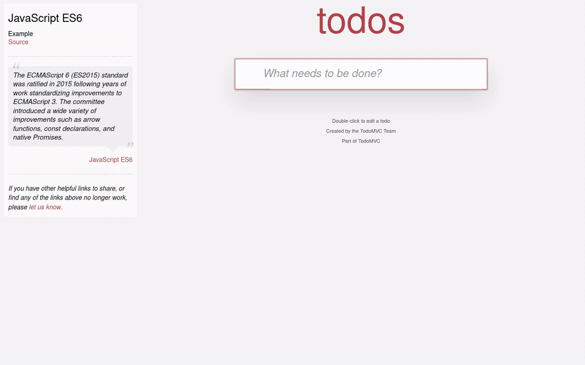

# Kaita — DOM History

Browser extension for Firefox and Chromium browsers (Chrome, Brave, Edge)
that records DOM snapshots of a page on demand and lets you browse and diff
them like a wiki page history. Kaita is Lithuanian for *change*.

Nothing runs on any page until you click **Record changes** on it, so
recording is opt-in per site. Snapshots are stored locally in IndexedDB and
never leave the browser.



## Privacy

Kaita records the HTML of a page only while you have clicked **Record
changes** on that page, and only for that tab. Snapshots are stored in the
browser's local IndexedDB on your device. Nothing is transmitted anywhere:
the extension makes no network requests of its own, has no analytics, no
accounts and no third-party services. Clear a tab's history with **Clear
collected history**, or remove everything by uninstalling the extension.

The **Page** tab in the viewer renders a snapshot in a sandboxed frame; the
frame may load stylesheets, images and fonts referenced by the snapshot
from the original site, exactly as a normal visit to that page would.

## Usage

1. Open the page you want to watch and click the toolbar button.
2. **Record changes** takes a snapshot immediately and then one after every
   burst of DOM mutations. The same button becomes **Stop recording**.
   A snapshot is the page's live DOM as HTML, including form state the
   markup alone does not carry (ticked boxes, typed values, chosen
   options); password fields are never captured.
3. **View changes** opens the history viewer for this tab.
4. **Clear collected history** deletes this tab's snapshots.

### Viewer

The left pane lists revisions with time, delta to the previous revision and
size; the `old` / `new` radio columns pick the pair to compare, defaulting to
the last two. `j` / `k` move the `new` selection, `Shift` + `j` / `k` move
`old`. **Diff** shows a unified line diff of the pretty-printed HTML with
unchanged regions collapsed to three lines of context; **Source** shows the
`new` snapshot; **Page** renders a snapshot in a sandboxed frame (scripts
disabled). Click any row to view that revision as a page without touching
the `old` / `new` diff selection; the `old` / `new` switch above the frame
goes back to following the diff selection. The snapshot is the DOM only:
inline styles are exact, but external stylesheets, images and fonts are
fetched from the live site, so the render can differ if the site has
changed them since. **Export** downloads the `new` snapshot as
`<timestamp>.html`.
The list refreshes every two seconds while the tab is still recording.

## Development

One Manifest V3 codebase serves both browser families. Firefox uses
`background.scripts`, Chromium uses `background.service_worker`; each ignores
the other's key. All extension code goes through
`globalThis.browser ?? globalThis.chrome`, so no polyfill is needed.

Firefox: load the `kaita/` directory via `about:debugging` → *This Firefox*
→ *Load Temporary Add-on* and pick `kaita/manifest.json`.

Chrome / Brave / Edge: open `chrome://extensions`, enable *Developer mode*,
click *Load unpacked* and pick the `kaita/` directory.

```sh
npm install
npm run lint
```

`npm run lint` runs `eslint .` and `web-ext lint`; both must report zero
errors. `npm run build` packs `kaita/` into `web-ext-artifacts/` for store
submission; see `STORE.md` for the listing checklist.

### Icons

`kaita/icons/icon.svg` is the only source. The PNGs the manifest references
are generated from it with `npm run icons`, which needs `rsvg-convert`
(librsvg). Edit the SVG, re-run the script, commit both.

### Demo recording

`npm run demo` regenerates `demo/demo.mp4`, `demo/demo.gif` and the store
screenshots in `demo/screenshots/` by driving a headless Firefox
(`FIREFOX_BINARY`, default `firefox` on `PATH`) through the extension on
<https://todomvc.com/examples/javascript-es6/dist/>, then stitching the
frames with `ffmpeg`. A toolbar popup cannot be opened by automation, so
the script loads the real `popup.html` in a tab bound to the demo page,
clicks its buttons there and composites that rendering over the page
frame; a copy of the extension with `<all_urls>` stands in for the
`activeTab` grant. The extension code itself runs unchanged.

### Vendored dependencies

`kaita/vendor/diff.js` is `lib/index.mjs` from the
[`diff`](https://www.npmjs.com/package/diff) package, version 7.0.0, copied
byte-for-byte with `npm run vendor:diff`. Never edit it by hand; bump the
pinned version in `package.json` and re-run the script instead.

## License

MIT, see `LICENSE`. The vendored `diff` library is BSD-3-Clause.
